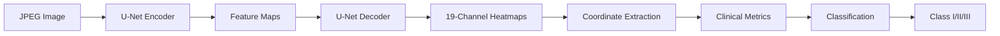

# 측면두부규격방사선사진 랜드마크 검출 프로젝트

**2025 KHD (Konyang Health Datathon) 본선 프로젝트**  
AI 기반 측면두부규격방사선사진 분석을 통한 부정교합 자동 진단 및 19개 해부학적 계측점 검출 시스템

##  프로젝트 개요

이 프로젝트는 치과 교정 및 턱관절 진료에서 핵심적인 측면두부규격방사선사진(cephalometric radiograph)에서 **19개 해부학적 랜드마크를 자동으로 검출**하고, 이를 바탕으로 **골격 유형(Class I/II/III)을 분류**하는 AI 모델을 개발합니다.

###  성능 목표
| 메트릭 | 기존 연구 | 우리 목표 | 달성 목표 |
|--------|-----------|-----------|-----------|
| **MRE** | 1.737mm | **< 1.5mm** | < 1.0mm |
| **SDR@2.5mm** | 94.7% | **> 96%** | > 98% |
| **분류 정확도** | - | **> 90%** | > 95% |

###  데이터셋 정보
- **총 데이터**: 30,199장의 JPEG 이미지 + JSON 어노테이션
- **랜드마크**: 19개 해부학적 계측점 (N, S, Ar, Or, Po, A, B, U1, Ls, Pog', Go, Pog, Me, ANS, PNS, Gn, L1, Li, Pn)
- **분류**: Class I(정상): 13,514장, Class II(상악 과성장): 11,348장, Class III(하악 과성장): 5,337장

---

##  프로젝트 구조

```
cephalometric_project/
├── 📂 data/                    # 데이터
│   ├── raw/                    # 원본 데이터 (안심존에서 다운로드)
│   │   ├── images/            # JPEG 이미지 파일들
│   │   │   ├── TS_1/          # Training 이미지
│   │   │   └── VS_1/          # Validation 이미지
│   │   └── json_files/        # JSON 어노테이션
│   │       ├── TL_1/          # Training JSON
│   │       └── VL_1/          # Validation JSON
│   └── processed/             # 변환된 데이터
│       ├── landmarks_data.csv # 🎯 핵심 결과물
│       ├── coco_keypoints.json
│       └── data_statistics.json
│
├── 📂 src/                     # 소스 코드
│   ├── models/
│   │   ├── __init__.py
│   │   ├── model_definitions.py # U-Net + ResNet + 개선된 모델
│   │   ├── backbones/         # ResNet, EfficientNet 등
│   │   └── modules/           # Attention, Deep Supervision
│   ├── utils/
│   │   ├── json_parser.py     #  JSON→CSV 변환 (핵심)
│   │   ├── loss_metrics.py    # Wing Loss, PCK, MRE, SDR
│   │   ├── visualization.py   # 시각화 도구
│   │   └── tensorboard_utils.py
│   ├── data_loader.py         # PyTorch Dataset + 데이터 증강
│   ├── train.py               #  학습 메인 스크립트
│   └── inference.py           # 추론 및 평가
│
├── 📂 experiments/             # 실험 관리
│   ├── configs/               # 10개 실험 설정 YAML
│   ├── scripts/               # 실행 스크립트들
│   ├── checkpoints/           # 실험별 모델 저장
│   ├── results/               # 실험별 결과
│   └── compare_results.py     # 결과 비교 분석
│
├── 📂 configs/
│   ├── config.yaml            # 기본 설정
│   └── offline_config.yaml    # 오프라인용 설정
│
├── 📂 checkpoints/             # 모델 저장소
├── 📂 results/                 # 결과 저장소
├── 📂 logs/                    # 로그 파일들
│
├── requirements.txt            # 기본 패키지
├── requirements_offline.txt    # 오프라인 패키지
├── setup_project.py           # 프로젝트 자동 생성
└── run_commands.sh            # 편의 실행 스크립트
```

---

##  모델 아키텍처

###  전체 시스템 구조


###  핵심 모델들

1. **Landmark Detection**: U-Net + ResNet Backbone
   - **입력**: 512×512 그레이스케일 이미지
   - **출력**: 19개 채널 히트맵 (각 랜드마크별)
   - **손실함수**: Wing Loss + MSE 조합

2. **Clinical Metrics**: 자동 계측 지표 계산
   - ANB, SNA, SNB, FMA 등 임상 각도 자동 산출
   - 기하학적 계산 기반 (삼각함수 활용)

3. **Classification**: 골격 유형 분류
   - **입력**: 임상 지표 + 이미지 특징 + 메타데이터
   - **모델**: XGBoost 또는 MLP
   - **출력**: Class I/II/III 확률

---

##  실험 설정

총 **10개의 실험**을 체계적으로 설계하여 성능 최적화를 진행합니다:

| 실험명 | 백본 | 모듈 | 손실함수 | 증강 | 특징 |
|--------|------|------|----------|------|------|
| **EXP01_Base** | ResNet18 | - | MSE | 기본 | 베이스라인 |
| **EXP02_WingLoss** | ResNet18 | - | Wing Loss | 기본 | 정밀도 개선 |
| **EXP03_ComboLoss** | ResNet18 | - | MSE+Wing | 기본 | 조합 손실 |
| **EXP04_ResNet34** | ResNet34 | - | MSE | 기본 | 깊은 네트워크 |
| **EXP05_SCSE** | ResNet34 | SCSE Attention | MSE+Wing | 기본 | 어텐션 메커니즘 |
| **EXP06_AdvancedAug** | ResNet34 | SCSE | MSE+Wing | 고급 | 데이터 증강 강화 |
| **EXP07_LRDecay** | ResNet34 | SCSE | MSE+Wing | 고급 | 학습률 스케줄링 |
| **EXP08_DropBlock** | ResNet34 | SCSE+DropBlock | MSE+Wing | 고급 | 정규화 강화 |
| **EXP09_BalancedLoss** | ResNet34 | SCSE | Landmark별 가중 MSE | 고급 | 불균형 해결 |
| **EXP10_FinetuneTop** | ResNet34 | SCSE | MSE+Wing | 고급 | 전이학습 |


---

##  성능 평가 지표

###  주요 메트릭

1. **MRE (Mean Radial Error)**: 평균 방사형 오차
   ```python
   MRE = np.mean(np.sqrt((pred_x - gt_x)² + (pred_y - gt_y)²))
   ```

2. **SDR (Success Detection Rate)**: 성공 검출률
   ```python
   SDR@2.5mm = (오차 < 2.5mm인 랜드마크 수) / 총 랜드마크 수 × 100%
   ```

3. **PCK (Percentage of Correct Keypoints)**: 정확 키포인트 비율
   ```python
   PCK@0.05 = (정규화 오차 < 0.05인 키포인트 수) / 총 키포인트 수 × 100%
   ```

###  랜드마크별 성능 분석
- **쉬운 랜드마크**: N, S, Me, Pog (MRE < 1.0mm 목표)
- **중간 랜드마크**: A, B, ANS, PNS (MRE < 2.0mm 목표)  
- **어려운 랜드마크**: Or, Po, Ar (MRE < 3.0mm 목표)

---

## 🔧 주요 기능

###  핵심 특징

1. **정확한 랜드마크 검출**
   - Wing Loss를 활용한 정밀한 좌표 예측
   - Multi-scale feature 활용으로 다양한 크기 대응

2. **임상 지표 자동 계산**
   - ANB, SNA, SNB, FMA 등 주요 각도 자동 산출
   - 치과 교정 진단에 직접 활용 가능한 정량적 지표

3. **설명 가능한 AI**
   - Grad-CAM을 통한 모델 판단 근거 시각화
   - 랜드마크별 신뢰도 점수 제공

4. **포괄적 평가**
   - 다양한 메트릭을 통한 종합적 성능 분석
   - 랜드마크별, 환자별 세부 분석 가능

### 개발 도구

- **모델 학습**: PyTorch + PyTorch Lightning
- **데이터 증강**: Albumentations
- **실험 관리**: OmegaConf + Hydra
- **시각화**: Matplotlib + Seaborn + Plotly
- **로깅**: WandB + TensorBoard

---

## 사용법 상세

### 고급 사용법

#### 1. 커스텀 실험 설정
```yaml
# configs/my_experiment.yaml
model:
  backbone: resnet50
  num_landmarks: 19
  
loss:
  type: wing_loss
  wing_w: 10.0
  
training:
  batch_size: 16
  learning_rate: 0.001
  epochs: 100
```

#### 2. 데이터 증강 커스터마이징
```python
# src/data_loader.py 수정
transform = A.Compose([
    A.Resize(512, 512),
    A.HorizontalFlip(p=0.5),
    A.Rotate(limit=15, p=0.7),
    A.RandomBrightnessContrast(p=0.5),
    A.GaussNoise(var_limit=0.001, p=0.3)
])
```

#### 3. 모델 앙상블
```bash
# 여러 모델의 예측 결과를 앙상블
python src/ensemble_predict.py \
    --models checkpoints/exp05_scse.pth checkpoints/exp07_lr_decay.pth \
    --weights 0.6 0.4 \
    --input test_data/ \
    --output ensemble_results.json
```

---

## 문제 해결

### 자주 발생하는 문제들

#### 1. 데이터 경로 문제
```bash
# 문제: 이미지와 JSON 파일 매칭 안됨
# 해결: 파일명 매칭 확인
python -c "
import pandas as pd
import glob
from pathlib import Path

df = pd.read_csv('data/processed/landmarks_data.csv')
case_ids = set(df['case_id'])

image_files = glob.glob('data/raw/images/*/*.jpeg')
image_names = {Path(f).stem for f in image_files}

missing = case_ids - image_names
print(f'Missing images: {len(missing)}')
if missing:
    print('Sample:', list(missing)[:5])
"
```

#### 2. GPU 메모리 부족
```bash
# 문제: CUDA out of memory
# 해결: 배치 크기 조정
# configs/config.yaml에서 batch_size: 16 → 8 또는 4
```

#### 3. 좌표 유효성 검사
```python
# 문제: 일부 랜드마크가 이미지 경계 밖
# 해결: 좌표 범위 검사 및 클리핑
def validate_coordinates(landmarks, image_size):
    h, w = image_size
    landmarks[:, 0] = np.clip(landmarks[:, 0], 0, w-1)
    landmarks[:, 1] = np.clip(landmarks[:, 1], 0, h-1)
    return landmarks
```

---

<div align="center">


[맨 위로 돌아가기](#측면두부규격방사선사진-랜드마크-검출-프로젝트)

</div>