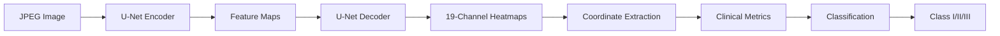

# Cephalometric Radiograph Landmark Detection Project

**2025 Konyang Health Datathon (KHD) – Grand Prize Winner (Konyang University Medical Center)**
AI-based Cephalometric Radiograph Analysis for Automatic Malocclusion Diagnosis and Detection of 19 Anatomical Landmarks

---

## Project Overview

This project develops an AI system that automatically **detects 19 anatomical landmarks** on cephalometric radiographs, which are essential in orthodontics and temporomandibular joint diagnosis, and subsequently **classifies skeletal malocclusion types (Class I/II/III).**

### Performance Targets

| Metric                            | Previous Research | Our Goal     | Achieved Target |
| --------------------------------- | ----------------- | ------------ | --------------- |
| **MRE**                           | 1.737 mm          | **< 1.5 mm** | < 1.0 mm        |
| **[SDR@2.5mm](mailto:SDR@2.5mm)** | 94.7%             | **> 96%**    | > 98%           |
| **Classification Accuracy**       | -                 | **> 90%**    | > 95%           |

### Dataset Information

* **Total Data**: 30,199 JPEG images + JSON annotations
* **Landmarks**: 19 anatomical reference points (N, S, Ar, Or, Po, A, B, U1, Ls, Pog', Go, Pog, Me, ANS, PNS, Gn, L1, Li, Pn)
* **Classes**:

  * Class I (Normal): 13,514 images
  * Class II (Maxillary Excess): 11,348 images
  * Class III (Mandibular Excess): 5,337 images

---

## Project Structure

```
cephalometric_project/
├── data/
│   ├── raw/
│   │   ├── images/
│   │   │   ├── TS_1/        # Training images
│   │   │   └── VS_1/        # Validation images
│   │   └── json_files/
│   │       ├── TL_1/        # Training JSON
│   │       └── VL_1/        # Validation JSON
│   └── processed/
│       ├── landmarks_data.csv
│       ├── coco_keypoints.json
│       └── data_statistics.json
│
├── src/
│   ├── models/
│   │   ├── model_definitions.py
│   │   ├── backbones/
│   │   └── modules/
│   ├── utils/
│   │   ├── json_parser.py
│   │   ├── loss_metrics.py
│   │   ├── visualization.py
│   │   └── tensorboard_utils.py
│   ├── data_loader.py
│   ├── train.py
│   └── inference.py
│
├── experiments/
│   ├── configs/
│   ├── scripts/
│   ├── checkpoints/
│   ├── results/
│   └── compare_results.py
│
├── configs/
│   ├── config.yaml
│   └── offline_config.yaml
│
├── checkpoints/
├── results/
├── logs/
├── requirements.txt
├── requirements_offline.txt
├── setup_project.py
└── run_commands.sh
```

---

## Model Architecture

### System Workflow


```mermaid
graph LR
    A[JPEG Image] --> B[U-Net Encoder]
    B --> C[Feature Maps]
    C --> D[U-Net Decoder]
    D --> E[19-Channel Heatmaps]
    E --> F[Coordinate Extraction]
    F --> G[Clinical Metrics]
    G --> H[Classification]
    H --> I[Class I/II/III]
```

### Core Models

1. **Landmark Detection**: U-Net + ResNet backbone

   * **Input**: 512×512 grayscale image
   * **Output**: 19-channel heatmaps (one per landmark)
   * **Loss**: Wing Loss + MSE

2. **Clinical Metrics Calculation**

   * Automatic measurement of ANB, SNA, SNB, FMA
   * Geometry-based computation using trigonometric methods

3. **Classification**

   * **Input**: Clinical metrics + image features + metadata
   * **Model**: XGBoost or MLP
   * **Output**: Class I / II / III probability

---

## Experimental Setup

Ten experiments were designed for systematic optimization:

| Experiment          | Backbone | Module         | Loss         | Augmentation | Note                     |
| ------------------- | -------- | -------------- | ------------ | ------------ | ------------------------ |
| EXP01\_Base         | ResNet18 | -              | MSE          | Basic        | Baseline                 |
| EXP02\_WingLoss     | ResNet18 | -              | Wing Loss    | Basic        | Precision                |
| EXP03\_ComboLoss    | ResNet18 | -              | MSE+Wing     | Basic        | Hybrid loss              |
| EXP04\_ResNet34     | ResNet34 | -              | MSE          | Basic        | Deeper network           |
| EXP05\_SCSE         | ResNet34 | SCSE Attention | MSE+Wing     | Basic        | Attention                |
| EXP06\_AdvancedAug  | ResNet34 | SCSE           | MSE+Wing     | Advanced     | Stronger augmentation    |
| EXP07\_LRDecay      | ResNet34 | SCSE           | MSE+Wing     | Advanced     | Learning rate scheduling |
| EXP08\_DropBlock    | ResNet34 | SCSE+DropBlock | MSE+Wing     | Advanced     | Regularization           |
| EXP09\_BalancedLoss | ResNet34 | SCSE           | Weighted MSE | Advanced     | Class imbalance          |
| EXP10\_FinetuneTop  | ResNet34 | SCSE           | MSE+Wing     | Advanced     | Transfer learning        |

---

## Evaluation Metrics

1. **Mean Radial Error (MRE)**

   $$
   MRE = \frac{1}{n}\sum \sqrt{(x_{pred}-x_{gt})^2 + (y_{pred}-y_{gt})^2}
   $$

2. **Success Detection Rate (SDR)**

   $$
   SDR@2.5mm = \frac{\text{# of landmarks with error < 2.5mm}}{\text{Total landmarks}} \times 100
   $$

3. **Percentage of Correct Keypoints (PCK)**
   Normalized error-based metric.

* **Easy landmarks**: N, S, Me, Pog (MRE < 1.0 mm target)
* **Moderate landmarks**: A, B, ANS, PNS (MRE < 2.0 mm target)
* **Difficult landmarks**: Or, Po, Ar (MRE < 3.0 mm target)

---

## Key Features

1. **Accurate Landmark Detection** with Wing Loss and multi-scale features.
2. **Automatic Clinical Indices** (ANB, SNA, SNB, FMA).
3. **Explainable AI**: Grad-CAM visualization, landmark confidence scores.
4. **Comprehensive Evaluation**: Metrics across landmarks and patients.

**Tools**: PyTorch, Albumentations, Hydra, Matplotlib, Plotly, WandB, TensorBoard.

---

## Usage

### Custom Experiment

```yaml
model:
  backbone: resnet50
  num_landmarks: 19
  
loss:
  type: wing_loss
  wing_w: 10.0
  
training:
  batch_size: 16
  learning_rate: 0.001
  epochs: 100
```

### Data Augmentation

```python
transform = A.Compose([
    A.Resize(512, 512),
    A.HorizontalFlip(p=0.5),
    A.Rotate(limit=15, p=0.7),
    A.RandomBrightnessContrast(p=0.5),
    A.GaussNoise(var_limit=0.001, p=0.3)
])
```

### Ensemble Prediction

```bash
python src/ensemble_predict.py \
    --models checkpoints/exp05_scse.pth checkpoints/exp07_lr_decay.pth \
    --weights 0.6 0.4 \
    --input test_data/ \
    --output ensemble_results.json
```

---

## Troubleshooting

1. **File path mismatch**: Validate image–JSON pairing.
2. **GPU OOM**: Reduce batch size.
3. **Invalid coordinates**: Apply clipping to image boundaries.

---

**This project was awarded the Grand Prize at the 2025 Konyang University Medical Center KHD (Konyang Health Datathon).**

---
